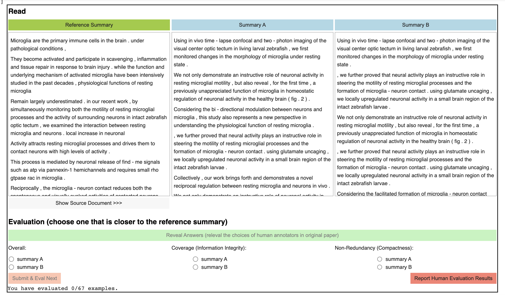

# MemSum: Extractive Summarization of Long Documents Using Multi-Step Episodic Markov Decision Processes

Code for ACL 2022 paper on the topic of long document extractive summarization: [MemSum: Extractive Summarization of Long Documents Using Multi-Step Episodic Markov Decision Processes](https://aclanthology.org/2022.acl-long.450/).

## Set Up Environment

1. create an Anaconda environment, with a name e.g. memsum
   
   **Note**: Without further notification, the following commands need to be run in the working directory where this jupyter notebook is located.
   ```bash
   conda create -n memsum python=3.10
   ```
2. activate this environment
   ```bash
   source activate memsum
   ```
   
3. Install pytorch (GPU version). 
   ```bash
   pip install torch torchvision torchaudio
   ```
4. Install dependencies via pip
   ```bash
   pip install -r requirements.txt
   ```

## Download Datasets and Pretrained Model Checkpoints

### Download All Datasets Used in the Paper


```python
import os
import subprocess
import wget

for dataset_name in [ "arxiv", "pubmed", "gov-report"]:
    print(dataset_name)
    os.makedirs( "data/"+dataset_name, exist_ok=True )
    
    ## dataset is stored at huggingface hub
    train_dataset_path = f"https://huggingface.co/datasets/nianlong/long-doc-extractive-summarization-{dataset_name}/resolve/main/train.jsonl"
    val_dataset_path = f"https://huggingface.co/datasets/nianlong/long-doc-extractive-summarization-{dataset_name}/resolve/main/val.jsonl"
    test_dataset_path = f"https://huggingface.co/datasets/nianlong/long-doc-extractive-summarization-{dataset_name}/resolve/main/test.jsonl"
    
    wget.download( train_dataset_path, out = "data/"+dataset_name )
    wget.download( val_dataset_path, out = "data/"+dataset_name )
    wget.download( test_dataset_path, out = "data/"+dataset_name )
```

### Download Pretrained Model Checkpoints

The trained MemSum model checkpoints are stored on huggingface hub


```python
from huggingface_hub import snapshot_download
## download the pretrained glove word embedding (200 dimension)
snapshot_download('nianlong/memsum-word-embedding', local_dir = "model/word_embedding" )

## download model checkpoint on the arXiv dataset
snapshot_download('nianlong/memsum-arxiv', local_dir = "model/memsum-arxiv" )

## download model checkpoint on the PubMed dataset
snapshot_download('nianlong/memsum-pubmed', local_dir = "model/memsum-pubmed" )

## download model checkpoint on the Gov-Report dataset
snapshot_download('nianlong/memsum-gov-report', local_dir = "model/memsum-gov-report" )
```

## Testing Pretrained Model on a Given Dataset

For example, the following command test the performance of the full MemSum model. Berfore runing these codes, make sure current working directory is the main directory "MemSum/" where the .py file summarizers.py is located.


```python
from src.summarizer import MemSum
from tqdm import tqdm
from rouge_score import rouge_scorer
import json
import numpy as np
```


```python
rouge_cal = rouge_scorer.RougeScorer(['rouge1','rouge2', 'rougeLsum'], use_stemmer=True)

memsum_arxiv = MemSum(  "model/memsum-arxiv/model.pt", 
                  "model/word_embedding/vocabulary_200dim.pkl", 
                  gpu = 0 ,  max_doc_len = 500  )

memsum_pubmed = MemSum(  "model/memsum-pubmed/model.pt", 
                  "model/word_embedding/vocabulary_200dim.pkl", 
                  gpu = 0 ,  max_doc_len = 500  )

memsum_gov_report = MemSum(  "model/memsum-gov-report/model.pt", 
                  "model/word_embedding/vocabulary_200dim.pkl", 
                  gpu = 0 ,  max_doc_len = 500  )
```


```python
test_corpus_arxiv = [ json.loads(line) for line in open("data/arxiv/test.jsonl") ]
test_corpus_pubmed = [ json.loads(line) for line in open("data/pubmed/test.jsonl") ]
test_corpus_gov_report = [ json.loads(line) for line in open("data/gov-report/test.jsonl") ]
```

### Evaluation on ROUGE


```python
def evaluate( model, corpus, p_stop, max_extracted_sentences, rouge_cal ):
    scores = []
    for data in tqdm(corpus):
        gold_summary = data["summary"]
        extracted_summary = model.extract( [data["text"]], p_stop_thres = p_stop, max_extracted_sentences_per_document = max_extracted_sentences )[0]
        
        score = rouge_cal.score( "\n".join( gold_summary ), "\n".join(extracted_summary)  )
        scores.append( [score["rouge1"].fmeasure, score["rouge2"].fmeasure, score["rougeLsum"].fmeasure ] )
    
    return np.asarray(scores).mean(axis = 0)
```


```python
evaluate( memsum_arxiv, test_corpus_arxiv, 0.5, 5, rouge_cal )
```

    100%|█████████████████████████████████████████████████████████████| 6440/6440 [08:00<00:00, 13.41it/s]

    array([0.47946925, 0.19970128, 0.42075852])


```python
evaluate( memsum_pubmed, test_corpus_pubmed, 0.6, 7, rouge_cal )
```

    100%|█████████████████████████████████████████████████████████████| 6658/6658 [09:22<00:00, 11.84it/s]

    array([0.49260137, 0.22916328, 0.44415123])


```python
evaluate( memsum_gov_report, test_corpus_gov_report, 0.6, 22, rouge_cal )
```

    100%|███████████████████████████████████████████████████████████████| 973/973 [04:33<00:00,  3.55it/s]

    array([0.59445629, 0.28507926, 0.56677073])


### Summarization Examples

Given a document with a list of sentences, e.g.:


```python
document = test_corpus_pubmed[0]["text"]
```

We can summarize this document extractively by:


```python
extracted_summary = memsum_pubmed.extract( [ document ], 
                                   p_stop_thres = 0.6, 
                                   max_extracted_sentences_per_document = 7
                                  )[0]
extracted_summary
```


    ['more specifically , we found that pd patients with anxiety were more impaired on the trail making test part b which assessed attentional set - shifting , on both digit span tests which assessed working memory and attention , and to a lesser extent on the logical memory test which assessed memory and new verbal learning compared to pd patients without anxiety . taken together ,',
     'this study is the first to directly compare cognition between pd patients with and without anxiety .',
     'results from this study showed selective verbal memory deficits in rpd patients with anxiety compared to rpd without anxiety , whereas lpd patients with anxiety had greater attentional / working memory deficits compared to lpd without anxiety .',
     'given that research on healthy young adults suggests that anxiety reduces processing capacity and impairs processing efficiency , especially in the central executive and attentional systems of working memory [ 26 , 27 ] , we hypothesized that pd patients with anxiety would show impairments in attentional set - shifting and working memory compared to pd patients without anxiety .',
     'the findings confirmed our hypothesis that anxiety negatively influences attentional set - shifting and working memory in pd .',
     'seventeen pd patients with anxiety and thirty - three pd patients without anxiety were included in this study ( see table 1 ) .']


```python

```

We can also get the indices of the extracted sentences in the original document:


```python
extracted_summary_batch, extracted_indices_batch = memsum_pubmed.extract( [ document ], 
                                   p_stop_thres = 0.6, 
                                   max_extracted_sentences_per_document = 7,
                                   return_sentence_position=1
                                  )
```


```python
extracted_summary_batch[0]
```


    ['more specifically , we found that pd patients with anxiety were more impaired on the trail making test part b which assessed attentional set - shifting , on both digit span tests which assessed working memory and attention , and to a lesser extent on the logical memory test which assessed memory and new verbal learning compared to pd patients without anxiety . taken together ,',
     'this study is the first to directly compare cognition between pd patients with and without anxiety .',
     'results from this study showed selective verbal memory deficits in rpd patients with anxiety compared to rpd without anxiety , whereas lpd patients with anxiety had greater attentional / working memory deficits compared to lpd without anxiety .',
     'given that research on healthy young adults suggests that anxiety reduces processing capacity and impairs processing efficiency , especially in the central executive and attentional systems of working memory [ 26 , 27 ] , we hypothesized that pd patients with anxiety would show impairments in attentional set - shifting and working memory compared to pd patients without anxiety .',
     'the findings confirmed our hypothesis that anxiety negatively influences attentional set - shifting and working memory in pd .',
     'seventeen pd patients with anxiety and thirty - three pd patients without anxiety were included in this study ( see table 1 ) .']


```python
extracted_indices_batch[0]
```


    [50, 48, 70, 14, 49, 16]


```python

```

## Training MemSum

Please refer to the documentation [Training_Pipeline.md](Training_Pipeline.md) for the complete pipeline of training MemSum on custom dataset.

You can also directly run the training pipeline on google colab: <a href="https://colab.research.google.com/github/nianlonggu/MemSum/blob/main/Training_Pipeline.ipynb" target="_parent"></a>


```python

```

## Updates

### Update 09-02-2023: Released the dataset for human evaluation (comparing MemSum with NeuSum). 
Data is available in folder human_eval_results/. It recorded the samples we used for human evaluation and records of participants' labelling.

Released a colab notebook that contained the interface for conducting human evaluation. This can be used for reproducibility test.

Jupyter notebook: [MemSum_Human_Evaluation.ipynb](MemSum_Human_Evaluation.ipynb)

Run it on colab: 
<!-- <a href="https://colab.research.google.com/github/nianlonggu/MemSum/blob/main/MemSum_Human_Evaluation.ipynb" target="_parent"></a> -->




### Update 28-07-2022: Code for obtaining the greedy summary of a document


```python
from data_preprocessing.utils import greedy_extract
import json
test_corpus_custom_data = [ json.loads(line) for line in open("data/custom_data/test.jsonl")]
example_data = test_corpus_custom_data[0]
```


```python
example_data.keys()
```


    dict_keys(['text', 'summary'])


We can extract the oracle summary by calling the function greedy_extract and set beamsearch_size = 1


```python
greedy_extract( example_data["text"], example_data["summary"], beamsearch_size = 1 )[0]
```


    [[50, 13, 41, 24, 31, 0, 3, 48], 0.4563635838327488]


Here the first element is a list of sentence indices in the document, the second element is the avarge of Rouge F1 scores.


```python

```

### References
When using our code or models for your application, please cite the following paper:
```
@inproceedings{gu-etal-2022-memsum,
    title = "{M}em{S}um: Extractive Summarization of Long Documents Using Multi-Step Episodic {M}arkov Decision Processes",
    author = "Gu, Nianlong  and
      Ash, Elliott  and
      Hahnloser, Richard",
    booktitle = "Proceedings of the 60th Annual Meeting of the Association for Computational Linguistics (Volume 1: Long Papers)",
    month = may,
    year = "2022",
    address = "Dublin, Ireland",
    publisher = "Association for Computational Linguistics",
    url = "https://aclanthology.org/2022.acl-long.450",
    pages = "6507--6522",
    abstract = "We introduce MemSum (Multi-step Episodic Markov decision process extractive SUMmarizer), a reinforcement-learning-based extractive summarizer enriched at each step with information on the current extraction history. When MemSum iteratively selects sentences into the summary, it considers a broad information set that would intuitively also be used by humans in this task: 1) the text content of the sentence, 2) the global text context of the rest of the document, and 3) the extraction history consisting of the set of sentences that have already been extracted. With a lightweight architecture, MemSum obtains state-of-the-art test-set performance (ROUGE) in summarizing long documents taken from PubMed, arXiv, and GovReport. Ablation studies demonstrate the importance of local, global, and history information. A human evaluation confirms the high quality and low redundancy of the generated summaries, stemming from MemSum{'}s awareness of extraction history.",
}
```

